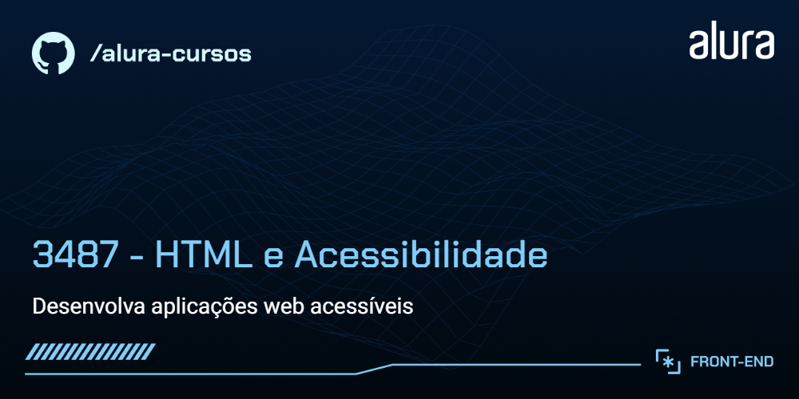

# Calmaria Spa

A Calmaria Spa é um empresa de bem estar e saúde. Nesse momento, temos o código inicial da sua landing page, onde encontramos pontos de melhoria para tornar o projeto acessível a todas as pessoas usuárias.

## 🔨 Funcionalidades do projeto

Nesse momento, nós temos a página que foi idealizada como entrega do time de desenvolvimento.

Durante o curso, nós analisamos toda a estrutura do HTML e refatoramos os pontos necessários do projeto.
O desafio foi encontrar pontos de melhoria na semântica do código HTML, para tornar o projeto Calmaria Spa acessível para todas as pessoas usuárias. 

## ✔️ Técnicas e tecnologias utilizadas

Se liga nessa lista de tudo que usaremos nesse curso:

- `HTML`
- `CSS`
- `Acessibilidade Web`
- `Figma`

E muito mais!

## 🛠️ Abrir e rodar o projeto

Para abrir e rodar o projeto, utilize um editor de código de sua escolha.

Depois, abra o projeto no seu navegador.

## 📚 Mais informações do curso

O Calmaria Spa é uma empresa fictícia utilizada nesse curso da Alura.
A ideia principal desse curso é evoluir ainda mais os conhecimentos em Acessibilidade Web com foco em CSS. 

Para acessar basta clicar aqui: https://calmaria-spa-delta.vercel.app/
